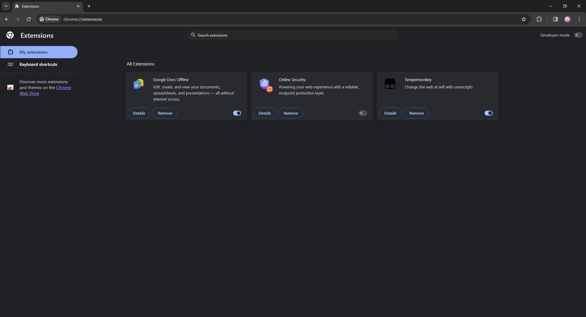
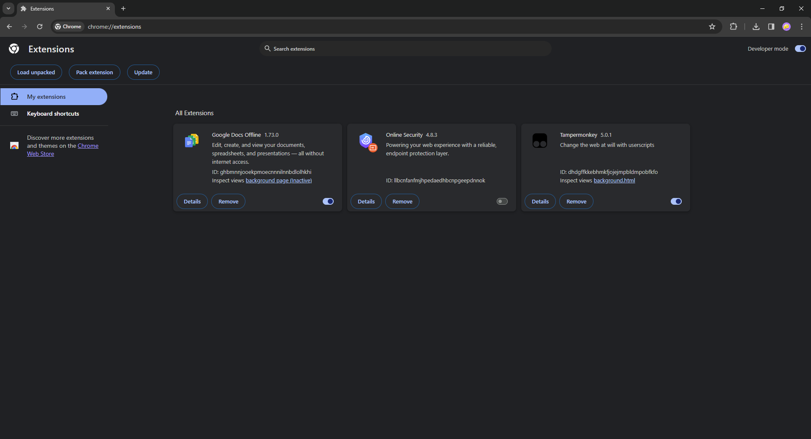
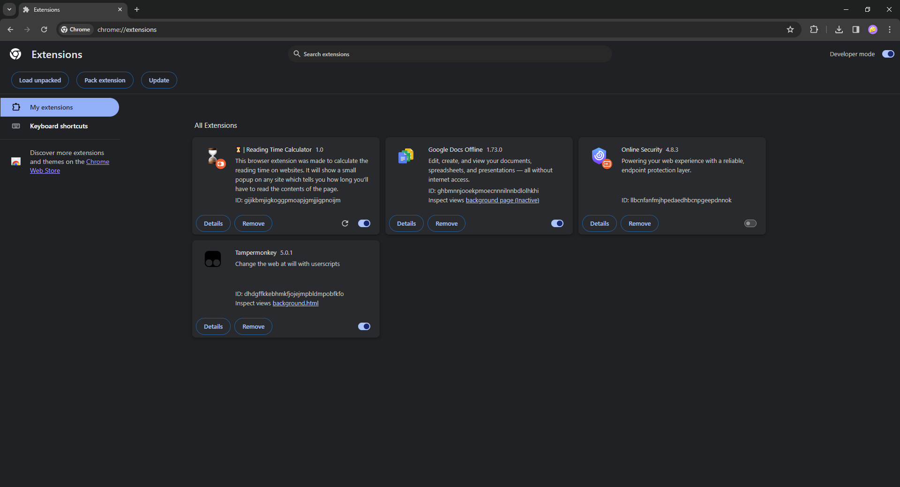
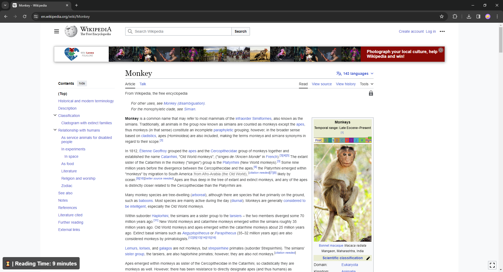

# ⌛ | Reading Time Calculator (Browser Extension)

This is a browser extension written in Javascript that calculates the time needed for reading the contents of a website.

## 📝 How to use

- Download the repository archive (.zip) and extract it or use `git`.

```shell
git clone https://github.com/nik-lmao/readingtime-calculator
```

- Open your browser and go to the extension settings.

- In the top right corner click on the "enable developer mode" button.



- Click on the "load unpacked" button in the top left corner.



- Select the path to the extension. (`./readingtime-calculator/extension`)



- The extension should appear in the menu.

<br>

### 💎 | This extension will show you a little overlay where you can see the estimated reading time on this website.

